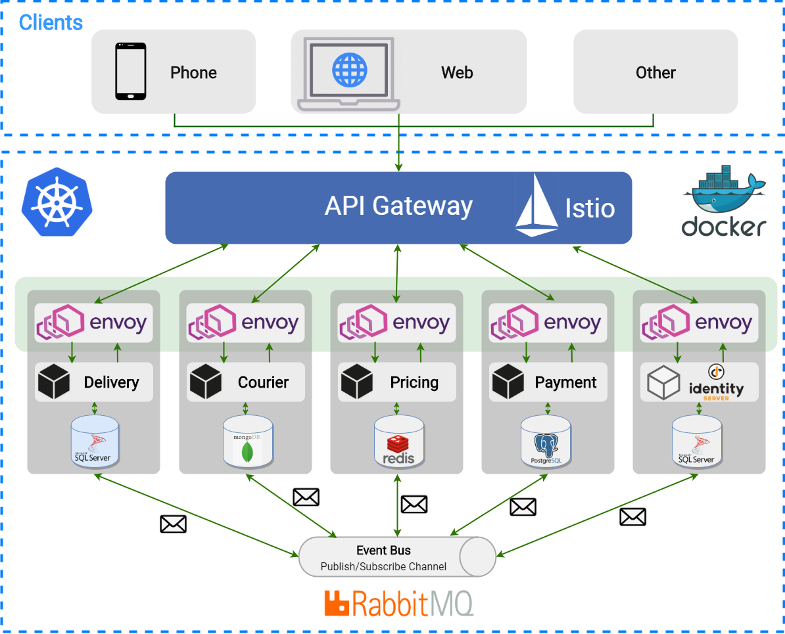

# Kangaroo

Kangaroo is containerized microservices application based on .NET Core. The project demonstrates how to develop small microservices for larger applications using containers, orchestration, service discovery, gateway, and best practices. You are always welcome to improve code quality and contribute it, if you have any questions or issues don't hesitate to ask in our [gitter](https://gitter.im/KangarooApp/community) chat.

## Motivation

- Developing independently deployable and scalable micro-services
- Developing cross-platform beautiful mobile apps using React native
- Configuring CI/CD pipelines using Travis CI, Github Actions, automated deployments using Google Kubernetes Engine, Docker Containers
- Using modern technologies such as gRPC, RabbitMQ, Service meshes
- Writing clean, maintainable and fully testable code, Unit Testing, Integration Testing and Mocking practices
- Using SOLID Design Principles
- Using Design Patterns and Best practices such as DDD and CQRS

## Architecture overview

The architecture proposes a microservice oriented architecture implementation with multiple autonomous microservices (each one owning its own data/db) and implementing different approaches within each microservice (simple CRUD vs. DDD/CQRS patterns) using REST/HTTP as the communication protocol between the client apps, and supports asynchronous communication for data updates propagation across multiple services based on gRPC, Integration Events and an Event Bus(RabbitMQ)

## List of micro-services and infrastructure components

<table>
   <thead>
    <th>№</th>
    <th>Service</th>
    <th>Description</th>
    <th>Build status</th>
    <th>Endpoints</th>
  </thead>
  <tbody>
    <tr>
        <td align="center">1.</td>
        <td>Delivery API (DDD, CQRS, EF Core, Dapper, SQL Server)</td>
        <td></td>
        <td>
            
        </td>
        <td></td>
    </tr>
    <tr>
        <td align="center">2.</td>
        <td>Courier API (CRUD, Repository, MongoDB)</td>
        <td></td>
        <td>
            
        </td>
        <td></td>
    </tr>
    <tr>
        <td align="center">3.</td>
        <td>Pricing API (Redis Cache, Google Maps API)</td>
        <td></td>
        <td>
            
        </td>
        <td></td>
    </tr>
    <tr>
        <td align="center">4.</td>
        <td>Identity API(soon) (.NET Core + IdentityServer4)</td>
        <td>Identity management service, powered by OAuth2 and OpenID Connect</td>
        <td>
           (soon)
        </td>
        <td></td>
    </tr>
    <tr>
        <td align="center">5.</td>
        <td>Payment API(soon) (DDD, CQRS, Postresql)</td>
        <td></td>
        <td>
           (soon)
        </td>
        <td></td>
    </tr>
  </tbody>  
</table>
 

## Contributing

1. Fork it
2. Create your feature branch: `git checkout -b my-new-feature`
3. Commit your changes: `git commit -m 'Adds some feature'`
4. Push to the branch: `git push origin my-new-feature`
5. Submit a pull request

## License

Code released under the [MIT license](https://github.com/Jamaxack/Kangaroo/blob/master/LICENSE).
